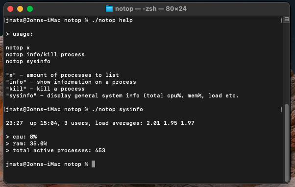

# notop

how the hell does `top` work anyways?

and other questions every linux/unix users has asked themselves at least once

simple solution: `notop`

its as simple as it is efficient. most top commands are just *clunky*. and it uses no direct system/kernel calls either. only commands that you'll already find on your system.

# install instructions

- clone the repo to your system

  `git clone https://github.com/jnats/notop`

- make sure install.sh is set as executable

  `chmod +x install.sh`

- run install.sh

  `./install.sh`

# dependencies

- either doas or sudo (for `install.sh` (or just run `install.sh` as root))

- ps
- tr
- sed
- cut
- bc
- uptime